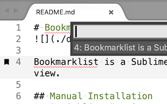
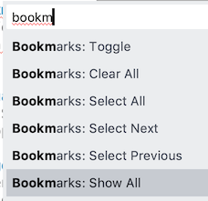

# Bookmarklist


Bookmarklist is a Sublime Text plugin that lists all your bookmarks in the current view.


## Manual Installation
1. In Sublime Text's menubar, go to ```Preferences ▶ Browse Packages```
1. Drop this repo in the directory that is opened

## Usage
1. Open the Command Palette using <kbd>control</kbd><kbd>shift</kbd><kbd>p</kbd> (that's <kbd>command</kbd><kbd>shift</kbd><kbd>p</kbd> for Mac users)
1. Select ```Bookmarks: Show All```
    - You'll need to set some bookmarks first for this list to show any.



## Notes
You can assign a keyboard shortcut for this command if you use it often. 
In the Command Palette, select ```Preferences: Key Bindings``` and add an entry to the file that opens. Example entry for <kbd>control</kbd><kbd>alt</kbd><kbd>b</kbd>:
```
{ "keys": ["ctrl+alt+b"], "command": "bookmarks_show_all" },
```
